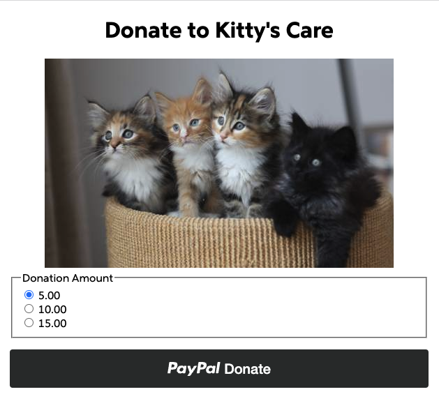
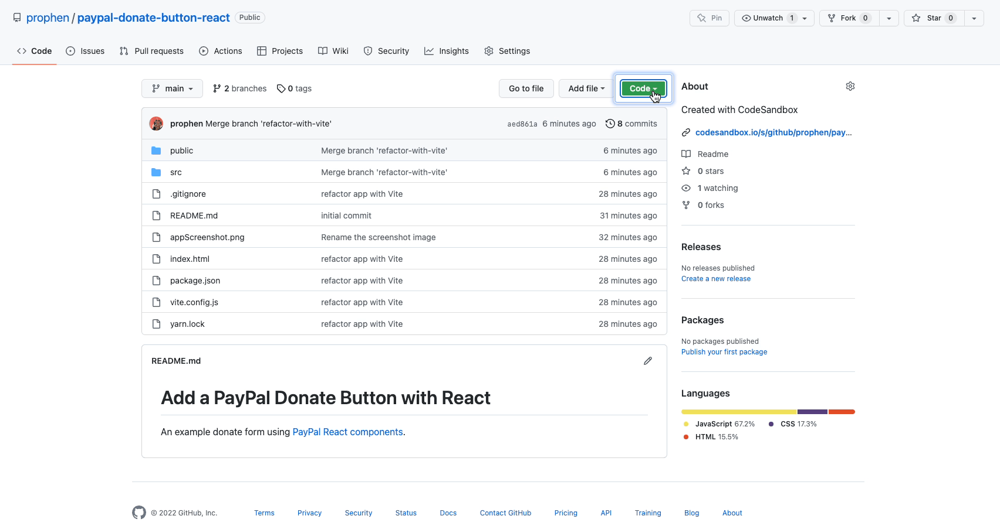

# Add a PayPal Donate Button with React

An example donate form using the React components for the PayPal JS SDK.

🔗 &nbsp; [react-paypal-js GitHub repository](https://github.com/paypal/react-paypal-js)

🔗 &nbsp; See a [live demo of this sample app on CodeSandbox](https://codesandbox.io/s/paypal-donation-button-example-f4jq38?file=/DonateApp.js)



## Setup

### 1. Clone or download the [code in this repo](https://github.com/prophen/paypal-donate-button-react).



> 💡 &nbsp; [Git Guide on the 'git clone' command](https://github.com/git-guides/git-clone)

### 2. Navigate to the app directory and install the dependencies

```
cd paypal-donate-button-react
```

**Install with npm**

```
npm install
```

### or

**Install with yarn**

```
yarn
```

### 3. Start the app

**Start with npm**

```
npm run dev
```

**Start with yarn**

```
yarn run dev
```

## Test in Sandbox

To use your own sandbox credentials instead of the `test` client ID, log in to the [developer dashboard](https://www.paypal.com/signin?returnUri=https%3A%2F%2Fdeveloper.paypal.com%2Fdeveloper%2Fapplications) and get your client ID from your default application.

> 💡 &nbsp; If you need help setting up your developer dashboard or finding your client ID, follow the first step in the getting started documentation to [get API credentials](https://developer.paypal.com/docs/business/get-started/#get-api-credentials)

Change the `clientID` from `"test"` to your client ID in the `DonateApp()` component found in **src/DonateApp.jsx**.

```javascript
export function DonateApp() {
  return (
    <PayPalScriptProvider
      options={{
        "client-id": "test",
        components: "buttons",
        currency: "USD",
      }}
    >
      <h1>Donate to Kitty's Care</h1>
      <figure>
        
        <figcaption></figcaption>
      </figure>
      <DonateForm />
    </PayPalScriptProvider>
  );
}
```

## Links to Documentation

<dl>
  <dt>React components for the PayPal JS SDK GitHub Repository</dt>
  <dd><a href="https://github.com/paypal/react-paypal-js">https://github.com/paypal/react-paypal-js</a></dd>
  <dt>Sample donate button code in Storybook</dt>
  <dd><a href="https://paypal.github.io/react-paypal-js/?path=/story/example-paypalbuttons--donate">https://paypal.github.io/react-paypal-js/?path=/story/example-paypalbuttons--donate</a></dd>
  <dt>PayPal JavaScript SDK Complete Reference</dt>
  <dd><a href="https://developer.paypal.com/docs/business/javascript-sdk/javascript-sdk-reference/">https://developer.paypal.com/docs/business/javascript-sdk/javascript-sdk-reference/</a></dd>
  <dt>CodeSandbox sample app</dt>
  <dd><a href="https://codesandbox.io/s/paypal-donation-button-example-f4jq38?file=/DonateApp.js">https://codesandbox.io/s/paypal-donation-button-example-f4jq38?file=/DonateApp.js</a></dd>
</dl>
